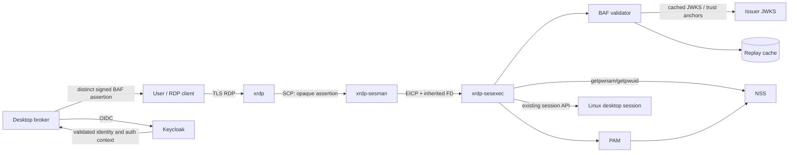
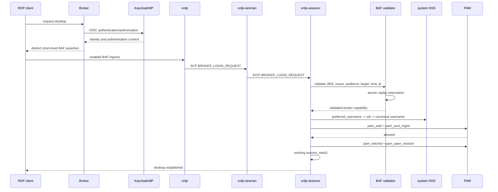
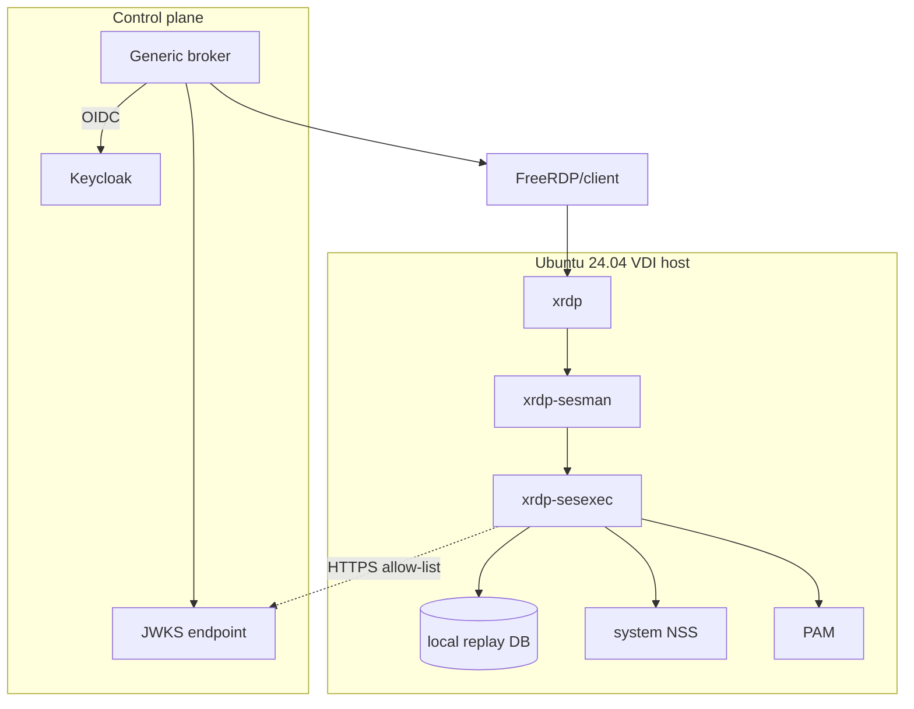

# Broker Authentication Framework — System Architecture

**Version:** 1.0
**Status:** Contractual specification
**Target:** Ubuntu 24.04, XRDP `devel`

## 1. Scope and normative language

The Broker Authentication Framework (BAF) adds broker-issued, signed
authentication assertions to XRDP without coupling XRDP to any broker product.
The key words **MUST**, **MUST NOT**, **SHOULD**, and **MAY** are interpreted as
specified by RFC 2119 and RFC 8174.

Keycloak is the primary user-facing IdP. The broker validates Keycloak/OIDC
identity and authorization context, then issues a distinct broker-neutral BAF
assertion. XRDP never validates a Keycloak token. BAF does not provision Linux
accounts or replace PAM account policy. Traditional XRDP username/password
authentication remains the default.

## 2. Architectural requirements

| ID | Requirement |
|---|---|
| ARC-001 | Broker-specific APIs and claims MUST remain outside XRDP core. |
| ARC-002 | The original signed assertion MUST reach the trusted local validator; no client-supplied “prevalidated” flag is trusted. |
| ARC-003 | Signature and claim validation MUST occur in `xrdp-sesexec` before PAM authentication is bypassed. |
| ARC-004 | `preferred_username` MUST resolve through system NSS. BAF MUST NOT create users. |
| ARC-005 | PAM `acct_mgmt`, credential, session, environment, close, and end phases MUST run for broker sessions. |
| ARC-006 | Classic password login MUST retain the current `pam_authenticate` path and wire format. |
| ARC-007 | XRDP MUST treat assertions as secrets and MUST NOT log them. |
| ARC-008 | Broker outage MUST NOT disable classic PAM login unless policy explicitly selects broker-only mode. |

## 3. Components

The broker authenticates the user through Keycloak OIDC, validates the OIDC
token and authentication context, and issues a separate assertion bound to one
XRDP target and broker session. XRDP never receives or validates the Keycloak
token and never calls a UDS-specific interface. The front end performs only
framing, size, and mode checks. `xrdp-sesexec`, already responsible for
privileged login lifecycle, performs BAF cryptographic and semantic validation.

### 3.1 Open-source reuse decisions

| Capability | Reused component | Rationale |
|---|---|---|
| RDP/TLS and login UI | XRDP/libxrdp | Avoid a parallel remote-display stack. |
| Process separation and session launch | sesman/sesexec/libipm | Preserve upstream privilege boundaries and lifecycle. |
| JWT/JWS | libjwt or equivalent mature JOSE library using OpenSSL | Avoid custom cryptography and parser ambiguity. |
| Linux identity | System NSS | Uses host-configured account sources without coupling BAF to a directory implementation. |
| Account/session policy | PAM | Existing policy, systemd-logind, limits, audit, and credential hooks. |
| Keys | HTTPS JWKS and/or local PEM trust anchors | Standard rotation and offline operation. |
| Replay state | local bounded cache; optional Redis adapter outside XRDP | Keep the core local and deterministic while permitting clustered deployments. |
| Service management | systemd | Native Ubuntu lifecycle, sandboxing, logging, and credentials. |

### 3.2 Major decision matrix

| Decision | Selected | Rejected alternatives | Rationale |
|---|---|---|---|
| Validation location | `xrdp-sesexec` | client, broker callback, unprivileged `xrdp` | sesexec owns trusted login state and prevents forged prevalidation. |
| JOSE implementation | libjwt/OpenSSL plus Jansson strict precheck | custom JWT, subprocess, direct Keycloak token | Packaged C libraries; no custom signatures or broker coupling. |
| Identity source | System NSS | assertion UID/groups, direct directory lookup | Preserves host Linux identity policy without directory coupling. |
| Account/session policy | PAM | provider-created session | Reuses pam_systemd, limits, audit, credentials, and cleanup. |
| Assertion transport | distinct SCP/EICP messages | password overloading, trusted boolean | Versionable, secret-aware, and backward-compatible. |
| Replay | atomic local interface, pluggable backend | no cache, broker callback | Works offline and fails closed; supports clustered state. |
| Key discovery | configured anchor/JWKS URL | token `jku`, generic discovery | Prevents SSRF and issuer/key substitution. |

## 4. Trust boundaries

1. **TB-1 External client boundary:** RDP client input is hostile.
2. **TB-2 Broker/issuer boundary:** a broker is trusted only through configured
   issuer identity and keys, never by network location alone.
3. **TB-3 XRDP process boundary:** `xrdp` is unprivileged and cannot authorize
   a PAM bypass.
4. **TB-4 sesman boundary:** local SCP/EICP transport is trusted for framing,
   not for assertion validity.
5. **TB-5 privileged validator boundary:** `sesexec` validation success creates
   a broker capability, not a Linux login identity or session authorization.
6. **TB-6 identity boundary:** remote identity becomes a Linux identity only
   after forward and reverse NSS lookup.
7. **TB-7 session boundary:** PAM policy and session hooks gate process launch.

See [trust-boundaries.mmd](diagrams/trust-boundaries.mmd).

## 5. Authentication and authorization sequence

Authentication proves issuer-controlled identity. Authorization is the
intersection of broker policy, assertion target/role constraints, XRDP sesman
group policy, NSS identity existence, and PAM account policy. No single remote
claim grants root or creates a local account.

## 6. Linux login and session lifecycle

1. Validate assertion and reserve `(iss,jti)` atomically.
2. Resolve `preferred_username` with `getpwnam_r()` semantics.
3. Reverse-resolve the UID; use the canonical NSS name.
4. Apply sesman allow/deny group rules.
5. Call the prevalidated PAM entry: `pam_start`, `PAM_RHOST`, `PAM_TTY`,
   `pam_acct_mgmt`.
6. Existing session startup calls `initgroups`, `pam_setcred`,
   `pam_open_session`, starts display server, window manager, and chansrv.
7. Existing cleanup calls `pam_close_session`, deletes credentials, and
   `pam_end`.

After replay reservation, failure in identity binding, authorization, PAM, or
session creation leaves the assertion unusable until expiry. A `released`
state is an audit marker only and never permits retry.

## 7. Deployment

The reference deployment separates the broker/IdP network from VDI hosts.
VDI hosts require outbound HTTPS to approved BAF JWKS endpoints only when
remote key retrieval is enabled. Their Linux account source is configured
through system NSS independently of BAF.

## 8. Failure principles

All validation is fail-closed. Unknown issuer/key/algorithm, stale JWKS beyond
policy, replay-cache failure, NSS ambiguity, or PAM failure denies broker
login. Classic PAM remains independently available. Errors returned to clients
are coarse; detailed reason codes are audit-only.

LDAP provisioning or synchronization, SSSD configuration or availability,
Active Directory, Kerberos, domain join, and Microsoft Entra are outside BAF
scope and are not deployment, conformance, release, or lab prerequisites. A
deployment may synchronize a Linux directory with Keycloak, but BAF neither
defines nor depends on that synchronization.

## 9. References

RFC 7515 (JWS), RFC 7518 (JWA), RFC 7519 (JWT), RFC 8725 (JWT BCP),
RFC 8785 (JCS), OpenID Connect Core, Linux-PAM, system NSS, and current XRDP
`devel`.
