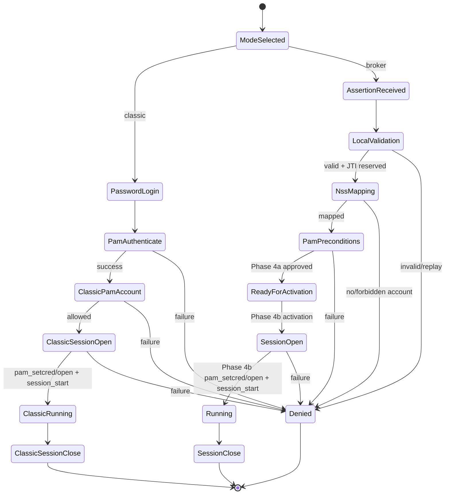

# XRDP Extension Specification

## 1. Purpose

This document defines the smallest upstream-facing change set for BAF. It is
normative about interfaces and behavior but does not prescribe implementation
syntax.

## 2. Requirements

| ID | Requirement |
|---|---|
| EXT-001 | Broker authentication MUST be disabled at build and runtime by default. |
| EXT-002 | Existing SCP/EICP password messages and state transitions MUST remain byte-compatible. |
| EXT-003 | Assertions MUST use distinct broker-login messages and MUST NOT overload a trusted boolean. |
| EXT-004 | `xrdp` and `xrdp-sesman` MUST transport the assertion opaquely and erase message buffers after use. |
| EXT-005 | `xrdp-sesexec` MUST validate the assertion before constructing prevalidated login state. |
| EXT-006 | Session launch MUST reuse existing `session_start()` and PAM lifecycle. |
| EXT-007 | Provider-specific code MUST compile behind a stable generic interface. |
| EXT-008 | Client-visible failures MUST not disclose whether a username exists. |
| EXT-009 | Assertion validation MUST NOT perform Linux or directory identity lookup. |
| EXT-010 | A validated broker capability alone MUST NOT authorize or start a session. |
| EXT-011 | Mandatory NSS/SSSD binding MUST produce a resolved Linux identity before PAM account/session processing or session creation. |
| EXT-012 | Later-stage failure MUST leave the assertion unusable until replay expiry; `released` is an audit marker only. |
| EXT-013 | Phase 4a output MUST remain internal and MUST NOT authorize or start a live session. |
| EXT-014 | Phase 4b MUST require validation, replay reservation, NSS identity binding, default UID 0 rejection, and PAM account approval before session authorization. |
| EXT-015 | In-band broker assertions MUST obey the effective framed transport bound and fail closed when oversized; MVP transport MUST NOT fragment. |

## 3. Modules

### 3.1 New modules

| Module | Responsibility |
|---|---|
| `sesman/libsesman/auth_provider.[ch]` | Stable provider request/result operations. |
| `sesman/libsesman/auth_provider_jwt.[ch]` | Generic BAF validation using libjwt/OpenSSL and Jansson strict parsing. |
| `sesman/libsesman/replay_cache.[ch]` | Replay backend abstraction; memory is test-only for live activation. |
| `sesman/libsesman/replay_cache_service.[ch]` | Fail-closed client for the trusted host-local replay service. |
| `xrdp-baf-replayd` | Persistent local replay authority with bounded atomic reserve/consume state. |
| `sesman/sesexec/identity_binding.[ch]` or equivalent | Phase 4a binding of a validated capability to a canonical Linux identity through NSS/SSSD. |
| `broker-auth/` | Schema, reference issuer, vectors, conformance tools; not linked into XRDP. |

The current skeleton name `auth_provider_broker` SHOULD become
`auth_provider_jwt` before API freeze, because “broker” describes the framework
and JWT/JWS describes the implementation.

### 3.2 Modified upstream modules

| File | Required change |
|---|---|
| `configure.ac` | Optional JOSE dependency and `--enable-broker-auth`. |
| `sesman/libsesman/Makefile.am` | Conditional provider/replay objects and libraries. |
| `libipm/scp_application_types.[ch]` | Broker login message and status enums. |
| `libipm/scp.[ch]` | Send/parse broker request; secret-buffer erasure. |
| `libipm/eicp.[ch]` | sesman-to-sesexec broker request/response. |
| `xrdp/xrdp_mm.c` | Select broker state machine and send opaque assertion. |
| `sesman/scp_process.c` | Route broker request to a new sesexec; no validation. |
| `sesman/sesexec/eicp_server.c` | Invoke provider and broker login construction. |
| `sesman/sesexec/login_info.[ch]` | NSS canonicalization and prevalidated login. |
| `sesman/libsesman/sesman_auth.h` | Explicit prevalidated account entry. |
| `verify_user_pam.c` | Skip only `pam_authenticate`; retain account/session. |
| `verify_user.c`, `verify_user_bsd.c` | Build-compatible prevalidated semantics. |
| `sesman/libsesman/sesman_config.[ch]` | Parse immutable broker policy. |

`sesman/sesexec/session.c` SHOULD NOT change.

## 4. Provider interface

The provider accepts:

- assertion byte string and length;
- client address;
- immutable validated configuration;
- expected audience and local target;
- current time from a testable clock abstraction.

`auth_provider_jwt` validates broker assertions only. On success it returns an
opaque capability containing canonical assertion
fields needed by sesman: issuer, subject, preferred username, broker session
ID, JTI digest, expiry, and client address. Accessors expose immutable values.
Only the validator can construct a successful capability. The capability owns
no PAM or session resources and is securely freed after login state is built.
It performs no NSS, SSSD, PAM, LDAP, FreeIPA, Active Directory, local
passwd/group, or equivalent identity lookup.

Providers return structured status, never partial success. Future providers may
validate a different signed assertion format but must meet the same identity,
target, time, and replay contract.

Only the validator may construct a validated broker capability. Only the
Phase 4a identity-binding path may convert one into a resolved Linux login
identity. Session creation requires both a validated capability and a resolved
Linux identity that has passed local authorization and PAM account/session
prerequisites. A capability alone never authorizes a session.

## 4.1 Phase 4a and Phase 4b activation boundary

Phase 4a consumes a validated broker capability, resolves and canonicalizes the
Linux identity through NSS/SSSD-compatible APIs, rejects UID 0 by default, and
obtains PAM account approval through the explicit prevalidated entry. Its output
is an internal identity-bound, PAM-precondition-approved result. Phase 4a MUST
NOT send a successful broker login response or activate a live session.

Phase 4b owns production state-machine and session activation wiring. A broker
session may be authorized only when all of the following are present:

1. a structurally and cryptographically valid broker assertion;
2. an atomic replay reservation;
3. a validator-created broker capability;
4. an NSS/SSSD-resolved canonical Linux identity;
5. default rejection of UID 0 and all applicable local policy checks;
6. PAM account approval; and
7. the existing PAM credential, session, environment, and cleanup lifecycle.

No individual or partial-stage success is session authorization. Phase 4b also
requires the replay reservation from the SD-004 trusted replay service;
worker-local memory replay state cannot authorize live activation. SD-008
selects RDS AAD Auth-style pre-logon `rdp_assertion` ingress as the preferred
MVP path. The MVP has no fragmentation, no username/password assertion
overloading, and no generic out-of-band bearer handles; SD-006 handles are
superseded for production ingress.

## 5. Authentication state machine

The broker path is phase-aware: Phase 4a terminates at
`ReadyForActivation` after PAM preconditions are approved and MUST NOT
transition to `SessionOpen`. `SessionOpen` and `Running` are Phase 4b states.
The separate classic password/PAM path and its existing session behavior are
unchanged.

Password retries retain current behavior. Broker assertion failures are not
retryable on the same assertion. A new assertion requires a new broker-login
request and is subject to normal rate limits.

## 6. Lifecycle details

The following is the completed target lifecycle. Phase 4a implements steps 4–7
as internal prerequisites without a successful live-login transition. Phase 4b
owns production wiring and the transition into step 8.

1. `xrdp_mm` selects `classic`, `broker`, or `auto` based only on server
   configuration and selected login profile.
2. Broker mode prefers SD-008 RDSAAD-style pre-logon ingress. After `PROTOCOL_RDSAAD` selection and TLS, XRDP receives an Authentication Request PDU carrying `rdp_assertion`.
3. The extracted assertion is handed to the existing BAF validation path; any internal forwarding must preserve opaque bytes and must not use username/password fields.
4. sesexec validates and reserves replay state.
5. The Phase 4a identity-binding path maps `preferred_username` through NSS and
   reverse UID lookup, producing a resolved Linux identity or denying login.
6. Existing sesman access policy runs.
7. Prevalidated PAM entry calls `pam_start` and `pam_acct_mgmt`.
8. In Phase 4b, existing create-session exchange and `session_start()`
   continue unchanged.
9. PAM session and assertion metadata live until session cleanup; raw assertion
   does not.

After validation, later identity-binding, authorization, PAM, or
session-creation failure leaves the assertion unusable until replay expiry.
The `released` state is an audit marker only and never permits retry.

## 7. Backward compatibility

When disabled, no broker object is linked and generated configuration is
identical except for commented documentation. When enabled but not selected,
classic behavior is identical. Protocol peers negotiate capabilities before
sending broker messages; old peers continue with classic messages. Unknown
messages produce “unsupported” and close only that authentication exchange.

No existing `username`, `password`, `pamusername`, or `pampassword` semantics
change. `enable_token_login` is not the BAF protocol and MUST NOT implicitly
enable BAF.

## 8. Error handling

| Class | Client response | Audit detail |
|---|---|---|
| Invalid assertion | Authentication failed | signature/header/claim category |
| Replay | Authentication failed | replay, hashed JTI |
| NSS mapping | Authentication failed | no mapping/forbidden UID |
| PAM account | Access denied | PAM result class |
| Provider unavailable | Service unavailable | key/cache/config dependency |
| Protocol/version | Unsupported authentication | peer version/capability |
| Internal/resource | Temporary failure | bounded diagnostic |

Raw assertions and library exception strings containing token material are
never logged. Failure timing is normalized consistently with existing sesman
anti-enumeration behavior.

## 9. Logging

Use XRDP’s existing logging framework and levels. INFO records successful
phase transitions without secrets. WARNING records policy denial, replay, key
refresh failure, or degraded last-known-good use. ERROR records internal
failure. DEBUG may log claim names and lengths, never values classified as
sensitive. Every event includes a generated correlation ID.

## 10. Selected validation dependencies

Version 1.0 uses **libjwt** with its OpenSSL backend for compact JWT/JWS
signature and registered-claim processing. Before policy processing, the
protected header and payload are decoded within the configured size bound and
parsed by **Jansson** with duplicate-key rejection. This precheck validates
JSON structure only; it never reserializes or replaces libjwt/OpenSSL signature
verification.

A compatibility wrapper isolates libjwt APIs from provider interfaces.
Replacing libjwt in a future release is permitted only when the replacement
passes the same conformance vectors without changing BAF, provider, or protocol
contracts.

## SD-008 RDSAAD-style ingress

SD-008 supersedes handle-first ingress for the MVP. XRDP must scaffold `PROTOCOL_RDSAAD` negotiation, Server Nonce, Authentication Request parsing, `rdp_assertion` extraction, BAF validation, trusted replay, and Authentication Result mapping. `S_OK` MUST NOT be returned until live authorization/session activation is actually complete. Trusted BAF runtime configuration for that future path is owned by sesman/xrdp-sesexec through the local `[BrokerAuth]` section and remains disabled by default.

### RDSAAD production integration foundation

The XRDP extension point for RDSAAD-style ingress is after TLS setup in the security layer and before MCS negotiation. This preserves classic TLS/RDP behavior for clients that do not request RDSAAD. Runtime-disabled or incomplete RDSAAD configuration fails closed rather than falling back to password login for the same RDSAAD request.
