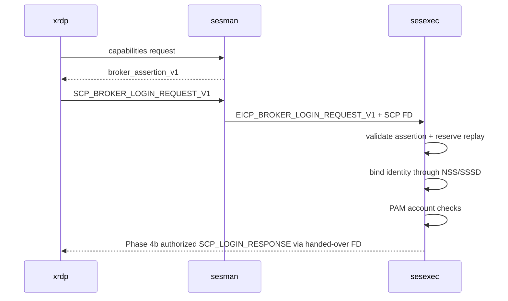

# API and Protocol Specification

## 1. Protocol principles

| ID | Requirement |
|---|---|
| PRO-001 | Broker assertion transport MUST be distinct from classic password login. |
| PRO-002 | The assertion MUST remain opaque until local validation in sesexec. |
| PRO-003 | Protocol capability negotiation MUST prevent new messages being sent to old peers. |
| PRO-004 | All length fields MUST be bounded and checked before allocation. |
| PRO-005 | Secret-bearing input/output buffers MUST be erased after use. |
| PRO-006 | Status codes MUST be stable, coarse across trust boundaries, and versioned. |
| PRO-007 | Effective assertion size MUST be the minimum of validator, transport, and framed libipm payload limits. |
| PRO-008 | MVP SCP/EICP transport MUST reject oversize assertions and MUST NOT fragment or use generic out-of-band assertion handles. The only permitted handle mechanism is SD-006 one-time server-side assertion handles; those handles are lookup keys, not assertion containers. |

## 2. Internal SCP additions

### 2.1 Capability exchange

On connection, peers exchange `SCP_CAPABILITIES_REQUEST/RESPONSE` when protocol
major version supports it. Capability bit `SCP_CAP_BROKER_ASSERTION_V1`
indicates support. Absence means classic behavior only.

### 2.2 Broker login request

Symbolic message: `SCP_BROKER_LOGIN_REQUEST_V1`.

| Field | Encoding | Limit |
|---|---|---|
| profile version | uint16 | value 1 |
| assertion | length-prefixed opaque bytes | effective framed transport maximum; nominal MVP ceiling 8 KiB |
| client address | UTF-8 string | 255 bytes |
| correlation ID | 16 bytes | UUID bytes |

The request contains no username and no “validated” flag. `xrdp` performs only
framing and configured-mode checks. The nominal 8 KiB in-band ceiling includes
all libipm/SCP framing and fields; it is not 8 KiB of assertion data. Senders
and receivers MUST derive and enforce the lower exact assertion boundary.

Response `SCP_LOGIN_RESPONSE` may be reused with the additional stable broker
status mapping, preserving existing session creation. Assertion validation
returns only a validated broker capability internally. Only after separate
NSS/SSSD identity binding and required local authorization/PAM processing may
a successful broker-login response return the canonical UID as current system
login does.

## 3. EICP additions

`EICP_BROKER_LOGIN_REQUEST_V1` carries the same profile, assertion, client
address, correlation ID, and transferred SCP file descriptor from sesman to
sesexec. `xrdp-sesman` MUST NOT parse claims. `EICP_BROKER_LOGIN_RESPONSE_V1`
returns success/failure, UID on success, and the SCP FD according to existing
handover rules.

The assertion buffer is erased in xrdp after SCP send, sesman after EICP send,
and sesexec immediately after provider validation. Size is checked at every
hop before allocation or forwarding where possible. Phase 4b rejects any input
above the effective maximum and does not fall back to classic authentication.

## 4. Version negotiation

Version is `(major,minor)`. Major incompatibility rejects broker mode; minor
features are capability bits. Peers ignore unknown capability bits. New
mandatory assertion semantics require a new assertion profile and capability.
Classic SCP messages are unchanged and require no negotiation.

The following sequence is the Phase 4b target lifecycle, not the completed
Phase 4a implementation. Phase 3 provides transport scaffolding only; Phase 4a
provides internal identity-binding and PAM prerequisites only; Phase 4b wires
the complete sequence into the production login response and session
authorization path.



## 5. Provider API contract

The internal provider ABI is not a public shared-library ABI in 1.0. It is a C
source interface built with XRDP. Operations are:

1. `is_available(config)`;
2. `validate_assertion(request, config) -> context/status`;
3. immutable context accessors for username and audit metadata;
4. `context_free`.

The request includes pointer+length, not NUL-dependent token handling. Provider
status distinguishes invalid, unauthorized, replay, unavailable, resource, and
internal failures. Only a successful opaque context can reach
`login_info_prevalidated_broker_user`.

### 5.1 Trusted replay IPC

Phase 4b workers reserve replay digests through a versioned, fixed-size
Unix-domain-socket protocol to the persistent host-local replay service. A
request contains an operation, the 32-byte replay-key digest, expiry, and an
optional correlation identifier; it never contains a JWT, username, or
broker-specific field. Supported operations are reserve, mark consumed, mark
released, status, cleanup expired, and ping. Unknown operations, malformed
lengths, invalid keys, expired or excessive expiry, capacity exhaustion,
timeouts, and unavailable or ambiguous responses fail closed. The default
endpoint is `/run/xrdp/baf-replay.sock`, restricted to XRDP/sesman processes.

## 6. Status codes

| Stable code | Meaning | Retry with same assertion |
|---|---|---:|
| `BAF_OK` | Valid and locally accepted | N/A |
| `BAF_ERR_INVALID` | Format/signature/claim invalid | No |
| `BAF_ERR_EXPIRED` | Time window invalid | No |
| `BAF_ERR_REPLAY` | JTI already reserved/consumed | No |
| `BAF_ERR_TARGET` | Audience or target mismatch | No |
| `BAF_ERR_IDENTITY` | NSS mapping/forbidden identity | No |
| `BAF_ERR_ACCOUNT` | PAM/local policy denial | No |
| `BAF_ERR_UNAVAILABLE` | Key/replay dependency unavailable | New assertion after recovery |
| `BAF_ERR_UNSUPPORTED` | Version/provider unavailable | No |
| `BAF_ERR_RESOURCE` | Bounded local resource failure | New attempt |
| `BAF_ERR_INTERNAL` | Internal invariant failure | New attempt |

Across SCP the first seven map to generic authentication failure except
unsupported and temporary service errors. Detailed codes remain local audit
data to prevent enumeration.

## 7. External broker interface

XRDP does not require a broker REST call. For interoperability, a reference
broker MAY expose:

### `POST /baf/v1/assertions`

Authenticated and authorized broker-side request:

```json
{
  "subject": "broker-stable-user-id",
  "preferred_username": "alice",
  "target": "urn:baf:desktop:tenant:pool:host",
  "broker_session_id": "session-uuid",
  "device_context_id": "opaque-reference"
}
```

Response (`201`, `Cache-Control: no-store`):

```json
{
  "assertion": "<compact-JWS>",
  "token_type": "BAF",
  "expires_in": 300
}
```

The endpoint requires TLS 1.2+, broker authentication (mTLS or OAuth 2.0
confidential client), idempotency controls, authorization for the requested
target, and audit. It returns OAuth-style JSON errors:
`invalid_request`, `unauthorized_client`, `access_denied`,
`invalid_target`, `temporarily_unavailable`, without identity leakage.

### `GET /.well-known/jwks.json`

Standard public JWKS with cache headers, unique `kid`, signing-use keys, and no
private material. XRDP consumes only the administrator-configured URL.

## 8. Reference JWT

Protected header:

```json
{"alg":"RS256","kid":"2026-rotation-a","typ":"baf+jwt"}
```

Claims conform exactly to Document 02. Keycloak tokens are not BAF assertions
unless a configured issuer intentionally emits the BAF profile. The reference
broker validates Keycloak/OIDC and produces a separate target-bound BAF token.

## 9. Limits and transport security

The validator's default 16 KiB maximum is an API validation ceiling, not an
in-band transport guarantee. For SCP/EICP, the effective maximum is:

```text
min(configured validator maximum,
    configured transport maximum,
    libipm/SCP/EICP payload capacity after framing overhead)
```

The MVP configured in-band ceiling is nominally 8 KiB. Implementations MUST
subtract message headers, length fields, profile version, client address,
correlation ID, transferred descriptor metadata, and any other framing. An
assertion exactly at the derived permitted boundary is accepted for transport;
one byte over is rejected before allocation/validation where possible.

The MVP defines no fragmentation and no generic out-of-band assertion handles.
The only permitted handle mechanism is SD-006: short-lived, one-time,
server-side assertion handles used for standard RDP broker compatibility. These
handles do not contain assertions, are target-bound, and are resolved only by
the trusted server-side assertion-handle service. Per SD-007,
target-mismatched resolution of a known handle consumes or invalidates the
handle, never returns assertion bytes, and cannot be retried later with the
correct target. The MVP MUST NOT raise libipm message bounds as an implicit
substitute. Fragmentation, generic bearer handles, and larger messages are
deferred to a separate versioned protocol/security decision.

RDP TLS is required. Local sockets use existing XRDP permissions and peer
credentials. Assertion fields cannot be copied into environment variables,
module parameters passed to desktop processes, or command lines. Protocol
fuzzing and maximum-length tests are release gates.

## SD-006 handle ingress

Phase 4b-1 permits only short-lived, high-entropy, one-time server-side assertion handles as defined by [SD-006](decisions/SD-006-one-time-server-side-assertion-handles.md). Atomic resolution fails closed and is not login authorization; live activation remains deferred.
