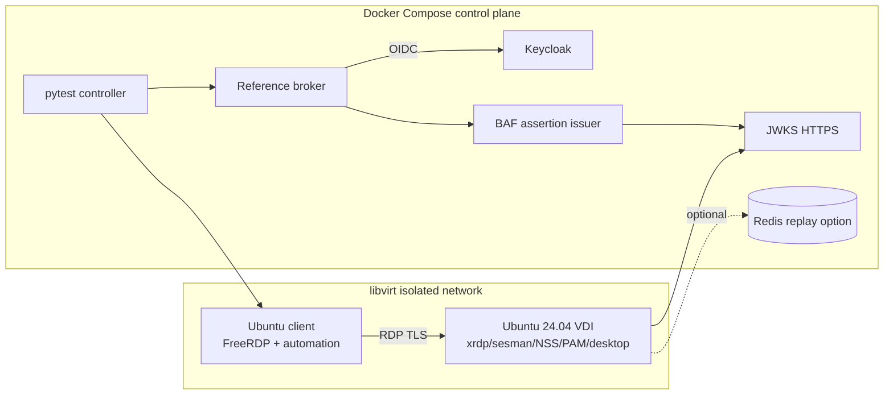
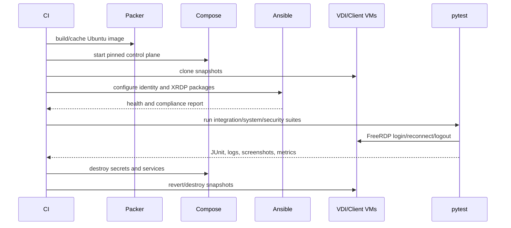

# Docker/KVM Test Laboratory

## 1. Purpose

Containers provide deterministic control-plane services; KVM provides the
systemd, system NSS, PAM, desktop, and kernel behavior containers cannot
represent faithfully.

## 2. Topology

## 3. Docker services

| Service | Image/function | Health condition |
|---|---|---|
| Keycloak | pinned upstream image, OIDC realm import | discovery and token endpoint ready |
| Reference broker | broker-independent test façade | validates Keycloak/OIDC, authorizes target, and requests distinct BAF issuance |
| Issuer | reference RS256 issuer; future PS256 fixture | assertion endpoint and rotation controls |
| JWKS | HTTPS endpoint with programmable keys/cache headers | TLS and expected key set |
| Replay cache | Redis only for clustered adapter testing | atomic SET NX + TTL |
| Test runner | pinned Python image | can reach all lab endpoints |

Images use immutable digests, non-production keys, read-only roots where
possible, health checks, resource limits, and an isolated bridge. Keycloak
seeds normal, disabled, MFA, and low/high assurance flows. The VDI image creates
deterministic system-NSS fixtures for normal, missing, ambiguous, and prohibited
UID cases independently of Keycloak identities.

## 4. KVM images

### 4.1 VDI

Packer builds Ubuntu 24.04 from a verified ISO. cloud-init creates test-only
administration, networking, CA trust, and SSH keys. Ansible installs the built
XRDP packages, desktop environment, system NSS test accounts, PAM
configuration, chrony or systemd-timesyncd, audit/journal forwarding, and test
instrumentation.

The VM has snapshots:

- `base`: patched Ubuntu;
- `identity`: system NSS/PAM configured;
- `xrdp-classic`: classic package;
- `xrdp-baf`: broker-enabled package.

### 4.2 Client

The client VM contains pinned FreeRDP, a virtual display, input/screenshot
automation, packet capture, and pytest agent. It validates TLS certificates and
never places assertions on command lines; assertions enter through protected
files/FIFOs or client API.

## 5. Networks and trust

| Network | Members | Policy |
|---|---|---|
| management | runner, VMs | SSH/API only |
| identity | Keycloak, broker | no inbound VDI; broker validates OIDC |
| desktop | client, VDI | RDP only |
| fault | proxy services | controllable delay/drop/reset/TLS faults |

The VDI cannot access arbitrary Internet during tests. DNS is deterministic.
Test CA issues service and RDP certificates. Fault proxies simulate JWKS
latency, stale responses, and partition.

## 6. Provisioning workflow

## 7. Automation

`docker compose` starts services. Terraform-libvirt or idempotent libvirt
scripts create networks/VMs. Packer creates images; cloud-init handles first
boot; Ansible converges configuration. pytest orchestrates APIs, faults,
FreeRDP, SSH assertions, journal queries, and artifact collection.

All scenarios have deterministic IDs and clocks. Time-boundary tests use VM
clock injection only in isolated snapshots. Private test keys are generated per
run and destroyed.

## 8. GitHub Actions

Hosted runners perform lint, unit, container integration, and package builds.
KVM jobs use ephemeral self-hosted Ubuntu 24.04 runners with nested
virtualization disabled unless explicitly trusted; preferred runners are
dedicated bare metal. Workflow permissions are read-only by default.
Untrusted fork PRs never receive secrets or run privileged KVM jobs.

## 9. Lab acceptance

The lab is acceptable when a clean invocation provisions without manual steps,
runs ST-001 through ST-003 and security scenarios, captures JUnit/journals/
pcaps/metrics with token redaction, destroys secrets, and reproduces from
documented pinned versions on a second runner.

Acceptance must prove that the broker validates Keycloak/OIDC and issues a
distinct BAF assertion, while XRDP validates only BAF and resolves Linux users
through system NSS before PAM. LDAP provisioning or synchronization, SSSD
configuration or availability, Active Directory, Kerberos, domain join, and
Microsoft Entra are not lab services or gates. A deployment may add a Linux
directory synchronized with Keycloak, but that topology is outside this lab.
