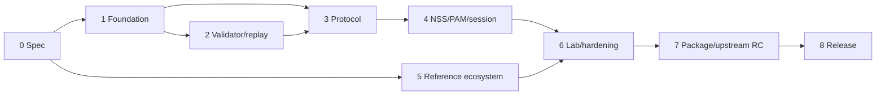

# Development Roadmap

## 1. Planning assumptions

Complexity uses S/M/L/XL and is comparative, not a calendar commitment.
Security and upstream review can extend any phase. Parallel work is permitted
only after its governing interface specification is frozen.

## 2. Phases

### Phase 0 — Specification and decisions

| Item | Definition |
|---|---|
| Objectives | Freeze BAF 1.0 architecture, claims, threats, protocol, configuration, and tests. |
| Deliverables | Documents 01–10, rendered diagrams, decision records, traceability. |
| Dependencies | Current XRDP architecture and Ubuntu support baseline. |
| Acceptance | Security/upstream/identity/broker teams approve with no unresolved architectural decision. |
| Complexity | M |
| Risks | Over-specification; mismatch with upstream maintainers. |
| Tests | Schema/examples and documentation CI. |
| Parallelization | Security review, lab design, JOSE library evaluation. |

### Phase 1 — Upstream-safe foundation

Objectives: compile-time option, generic provider types, explicit
prevalidated PAM account entry, and unchanged classic behavior.

Deliverables: small reviewed commits, PAM mocks, both-mode build matrix.
Dependencies: Phase 0. Acceptance: classic calls `pam_authenticate`; only a
later resolved broker-login path may skip it; a capability alone cannot
authorize a session; PAM account/session tests pass. Complexity M.
Risks: accidental bypass API or backend inconsistency. Testing: UT-012,
IT-006, sanitizers. Parallel: Python vectors and CI setup.

### Phase 2 — Assertion validator and replay core

Objectives: select/integrate mature JOSE library, strict BAF assertion
validation, trust-anchor/JWKS loading, clock, and atomic replay abstraction.
This phase performs no NSS/SSSD mapping, PAM account/session processing, or
session startup. Phase 2 is RS256-only; PS256 and ES256 are future extensions.

Deliverables: generic JWT provider returning a validated broker capability,
trust loader, memory/SQLite replay backend, conformance vectors, and fuzz
suites. The capability alone cannot authorize or start a session.
Dependencies: Phase 1 and library ADR. Acceptance: AST-001–012, SEC-001–003,
UT-001–009, FUZ-001 pass. Complexity XL. Risks:
parser ambiguity, key rotation, library packaging. Parallel: replay backend,
JWKS client, fuzz harness after interfaces freeze.

### Phase 3 — SCP/EICP transport and xrdp integration

Objectives: negotiate capabilities, carry opaque assertions, erase buffers,
and invoke validator in sesexec.

Deliverables: protocol additions, state machine, mode configuration, negative
protocol tests. Dependencies: Phases 1–2. Acceptance: old/new peer matrix,
UT-010–011, no token logs, no classic wire change. Complexity L. Risks:
secret lifetime, handover races, upstream protocol review. Parallel: SCP and
EICP implementations with shared vectors.

### Phase 4 — Identity, PAM, and session integration

Objectives: mandatory NSS/SSSD identity binding, prohibited-user and local
identity checks, PAM account/session integration, failure handling after replay
reservation, existing session lifecycle, and audit correlation.

Deliverables: completed broker login path and identity/PAM integration tests.
Session creation requires both the validated capability and a resolved Linux
identity; later-stage failure leaves replay unusable until expiry.
Dependencies: Phase 3, test LDAP/SSSD. Acceptance: IT-001–003 and ST-001 pass;
UID 0 denied; PAM denial final; session cleanup exactly once. Complexity L.
Risks: directory aliases, offline cache, PAM distribution variance. Parallel:
SSSD lab and PAM test modules.

### Phase 5 — Reference ecosystem and interoperability

Objectives: broker-neutral reference issuer/API, Keycloak-backed reference
broker, static vectors, administrator documentation.

Deliverables: container services, REST API, JWKS rotation, example policies.
Dependencies: BAF 1.0 profile. Acceptance: INT-001, IT-004, no reference-specific
XRDP code. Complexity M. Risks: examples mistaken for production defaults.
Parallel: reference broker and issuer/vector work.

### Phase 6 — Full laboratory and hardening

Objectives: reproducible Docker/KVM lab, fault injection, fuzzing, performance,
stress, operational recovery.

Deliverables: Packer/cloud-init/Ansible/libvirt automation, dashboards,
runbooks, security report. Dependencies: Phases 2–5. Acceptance: all SEC,
PERF, ST, ACC tests; 24-hour stability; second-runner reproduction. Complexity
XL. Risks: flaky GUI automation and privileged-runner security. Parallel:
image pipeline, FreeRDP automation, fault suite.

### Phase 7 — Packaging, upstreaming, and release candidate

Objectives: Ubuntu 24.04 DEBs, upgrade/rollback, upstream-quality patch series,
signed RC.

Deliverables: packages, SBOM/provenance, migration guide, rendered spec,
upstream PRs. Dependencies: full gates. Acceptance: clean install and upgrade,
classic rollback, upstream review issues resolved, release checklist green.
Complexity L. Risks: upstream API changes and dependency availability.
Parallel: packaging, docs, and upstream PR preparation.

### Phase 8 — BAF 1.0 release and operations

Objectives: publish stable profile/implementation and establish maintenance.
Deliverables: signed release, vulnerability process, compatibility matrix,
support runbooks, metrics/SLOs. Acceptance: production pilot with classic
fallback, recovery drill, no critical findings. Complexity M. Risks: issuer
misconfiguration and operational key handling.

## 3. Dependency graph

## 4. Global stop conditions

Work stops for unresolved authentication bypass, raw-token logging, inability
to fail closed, JOSE library critical vulnerability, replay race, classic PAM
regression, UID 0 mapping, non-reproducible privileged tests, or an upstream
architecture objection requiring specification revision.

## 5. Definition of done

BAF 1.0 is done only when two independent teams can implement issuer and XRDP
validator from these documents; all requirements trace to tests; classic PAM,
LDAP/FreeIPA/AD through SSSD, and optional Keycloak scenarios pass; operational
rotation/revocation/recovery is demonstrated; and upstream-facing changes are
minimal, generic, reviewed, and documented.
